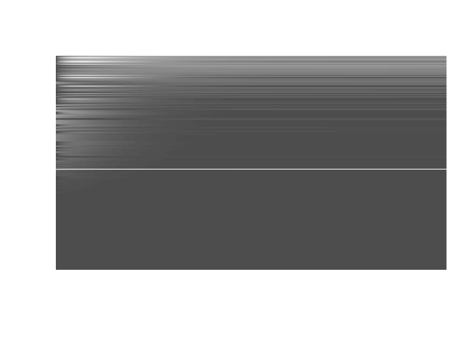

Example run of MFGC class
================
Giovanni Diana
September 2, 2020

Generate GC dynamics
--------------------

From python we can use the MFGC class to create a new instance of the network and use the `integrate` method to obtain the granule cell dynamics.

``` python
from MFGC_class import *

nGC = 200
nMF = 50
MFTYPES = 2
net = MFGC(nMF, nGC, MFTYPES)
net.integrate()
net.write_response("output.dat")
```

Visualize data with R
---------------------

Then we can import in `R` the data saved in `output.dat` for quick inspection

``` r
r <- as.matrix(read.table("output.dat"))
image(r[,order(apply(r,2,mean))],col=grey.colors(100),frame=FALSE,axes=FALSE)
```


